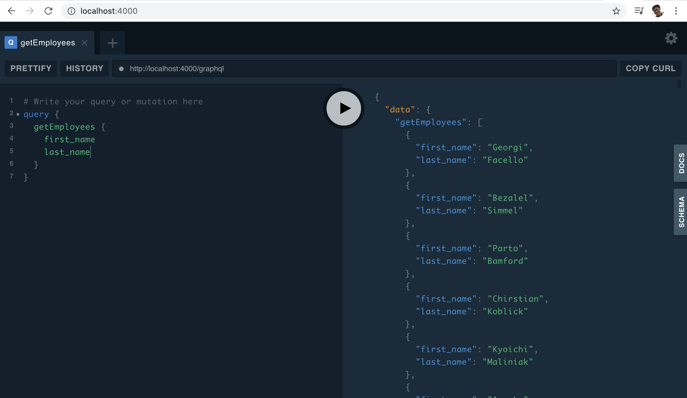

# GraphQL Mesh simple example with MySQL on Docker

Simpler docker setup for GraphQL Mesh and MySQL.

# Start up

```sh
# Download MySQL example database loader
git clone https://github.com/datacharmer/test_db
docker-compose up -d mysql
# Watch logs of mysql and wait.
docker-compose logs -f
# Find the message showing mysql is ready like this
# mysql_1  | 2020-04-27 03:20:07+00:00 [Note] [Entrypoint]: MySQL init process done. Ready for start up.

# Ctrl+C to return and run GraphQL Mesh
<Ctrl+C>
docker-compose up -d mesh
```

Access `http://localhost:4000`.




# Cleanup

```sh
docker-compose down
```

# Reference

- [GraphQL Mesh](https://github.com/Urigo/graphql-mesh)
- [GraphQL Mesh MySQL Employee example](https://github.com/Urigo/graphql-mesh/tree/master/examples/mysql-employees)
- [Employee database](https://github.com/datacharmer/test_db)
- [GraphQL Mesh Docker](https://github.com/onelittlenightmusic/graphql-mesh-docker)